# 系统工作流程

## 整体架构

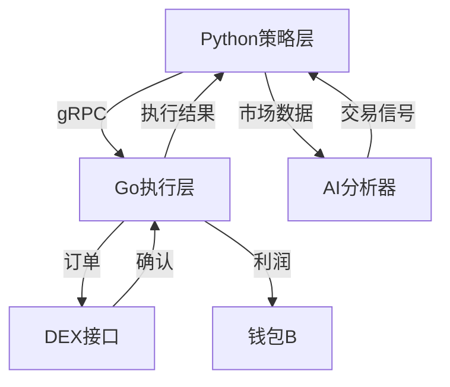

## 交易流程

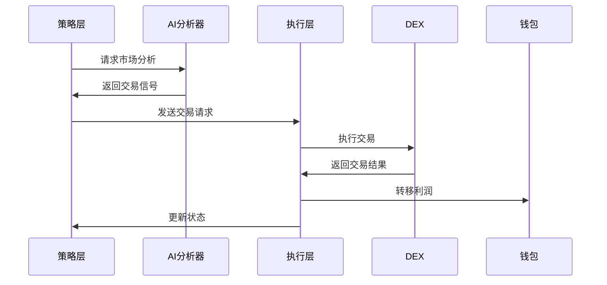

## 数据流

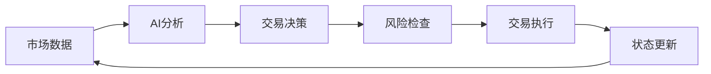

## 组件交互

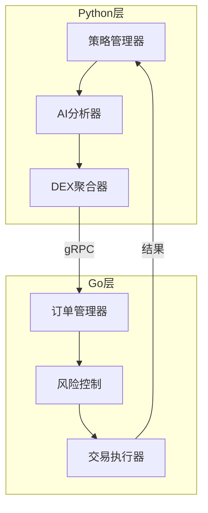

## 风险控制流程

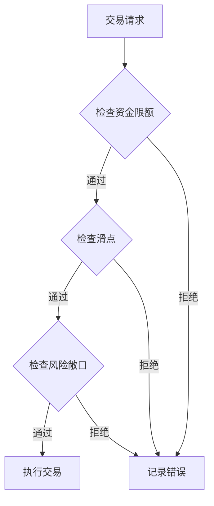

## 监控系统

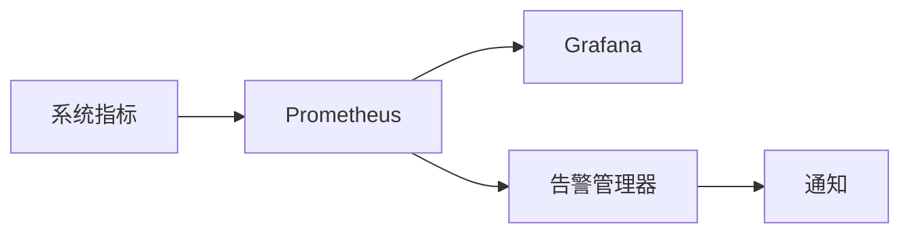

## 错误处理流程

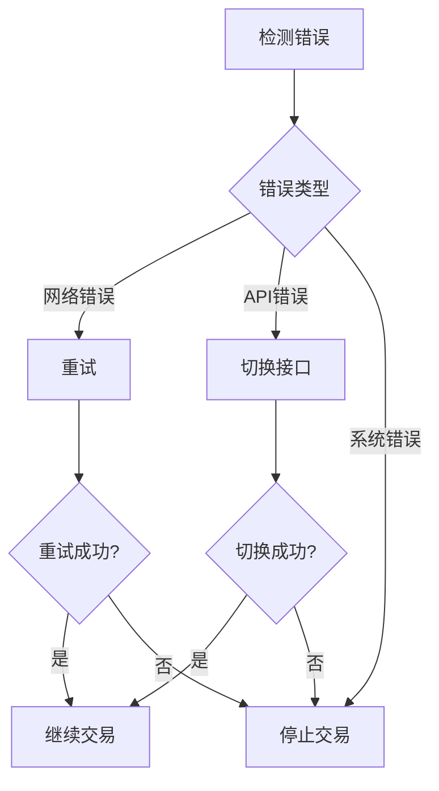

## 部署架构

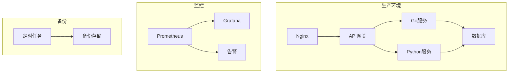

## 钱包管理


## 系统状态转换

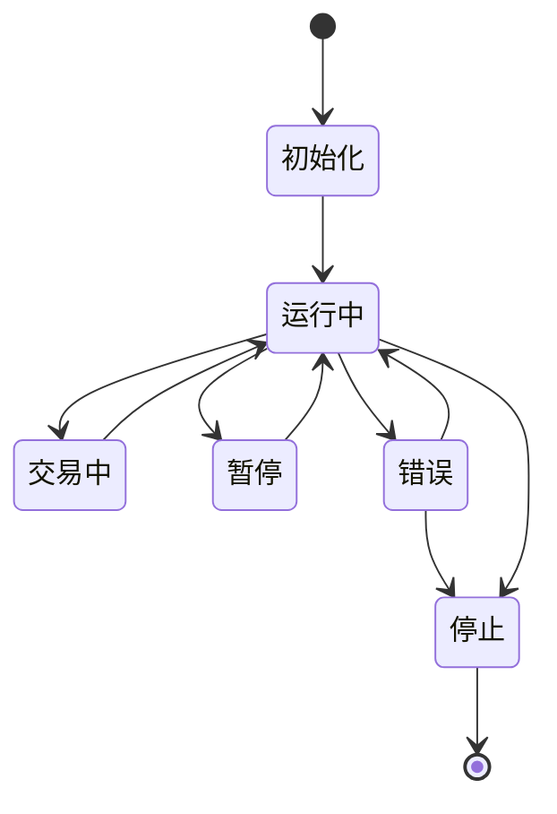

## 配置管理

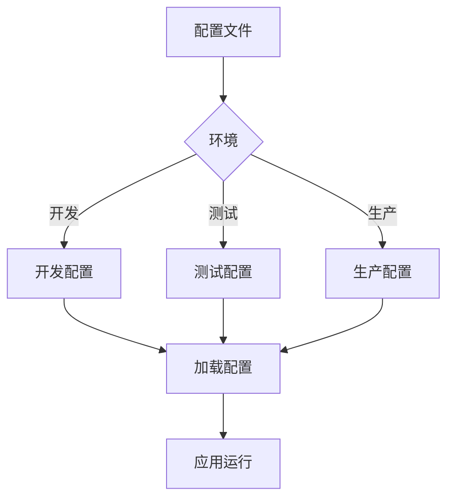

## 日志系统

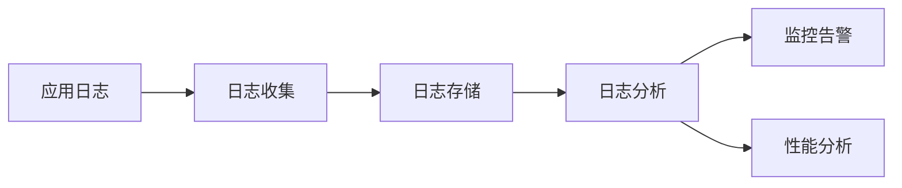

## 更新流程

```mermaid
graph TD
    A[代码更新] --> B[测试环境]
    B --> C{测试通过?}
    C -->|是| D[预发布环境]
    C -->|否| A
    D --> E{验证通过?}
    E -->|是| F[生产环境]
    E -->|否| A
