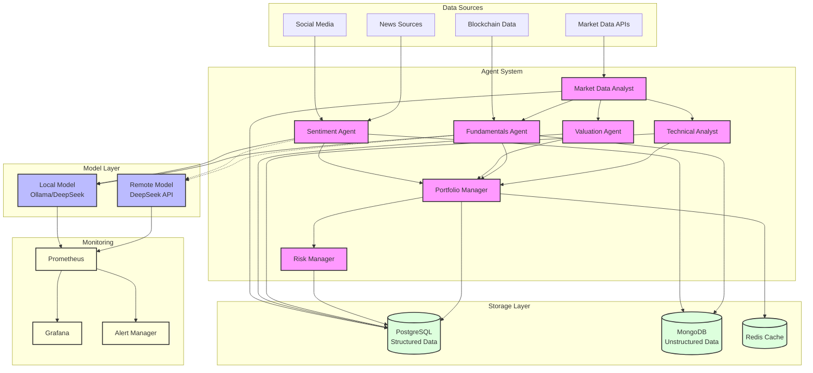

# Trading System Architecture

## Component Overview

## Data Flow Description

1. **Data Collection Layer**
   - Market Data Analyst collects real-time market data
   - Sentiment Agent gathers news and social media data
   - Fundamentals Agent retrieves on-chain and project metrics

2. **Analysis Layer**
   - Local-first model processing through Ollama/DeepSeek
   - Remote model fallback when needed
   - Each agent processes domain-specific data

3. **Decision Layer**
   - Portfolio Manager aggregates signals from all agents
   - Risk Manager validates decisions against risk parameters
   - Final trading decisions executed through order management

4. **Storage Layer**
   - PostgreSQL: Structured data (orders, positions, metrics)
   - MongoDB: Unstructured data (sentiment, analysis results)
   - Redis: Real-time caching and temporary data

5. **Monitoring Layer**
   - Prometheus tracks system metrics and model performance
   - Grafana provides visualization dashboards
   - Alert Manager handles system notifications

## Key Features

1. **Local-First Model Architecture**
   - Primary: Local Ollama/DeepSeek models
   - Fallback: Remote DeepSeek API
   - Automatic failover handling

2. **Multi-Agent Coordination**
   - Hierarchical decision making
   - Specialized analysis domains
   - Coordinated signal generation

3. **Dual Database Strategy**
   - Structured data in PostgreSQL
   - Unstructured data in MongoDB
   - High-performance caching with Redis

4. **Comprehensive Monitoring**
   - Model performance metrics
   - System health monitoring
   - Real-time alerting system
